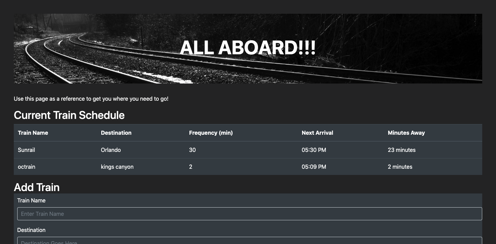

# TrainSchedule

This is an app in which the user can input the name of the train, the time the first train arrives of the day,and how frequent another train arrives at the station, and the app will caluclate two things:

1. The time that the next train will arive.

2. How many minutes until the next train.

Also, this app uses Firebase to store the data so that even when the user refreshes the page, the information is still there because it is stored in a database that is not local to the users computer.

